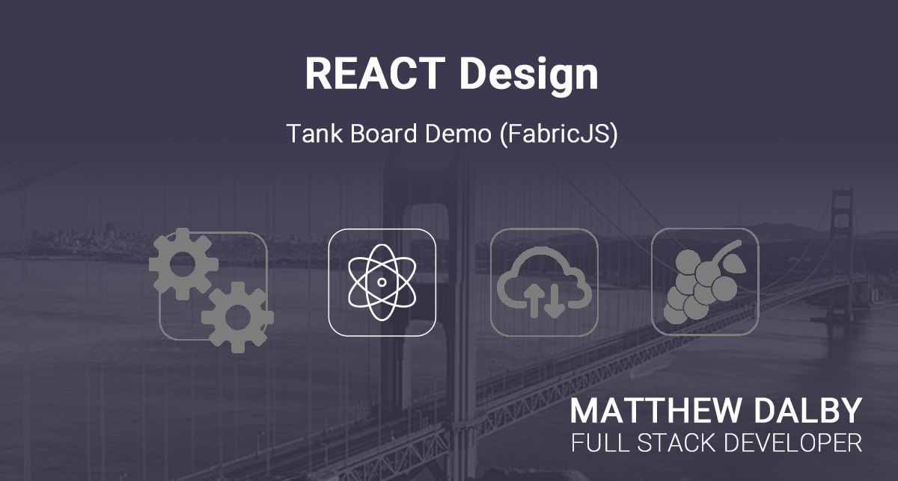
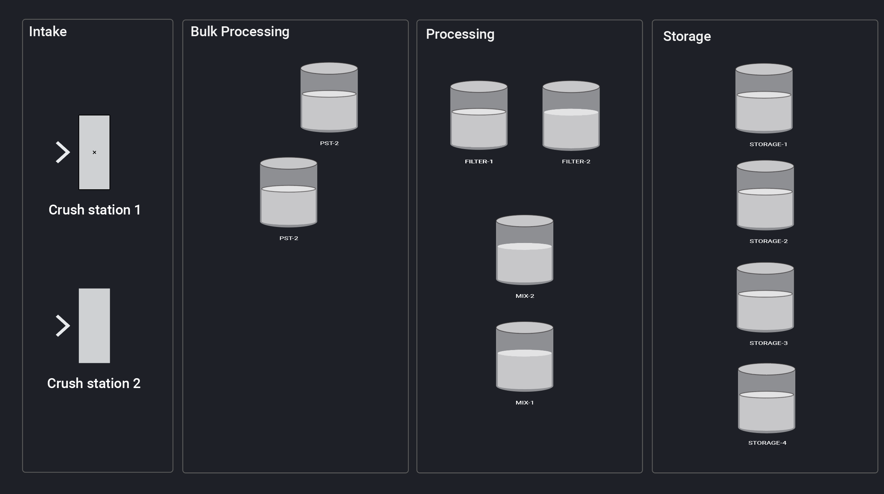

# Tank Board Demo

## Background
This project demonstrates how an dynamic, interactive HTML canvas element to provide visualization into a manufacturing process. The HTML canvas API is nothing short of impressive, however very low level. It provdes the bulding blocks however for other open source libraries to wrapper it for ease of use. In this case, FabricJS (https://fabricjs.com/).

Basically during the manufacturing process, raw oranges are squeezed by a certain specialized machine where the content is converted to raw orange juice where it goes through a series of operations as it makes it's way along collection or 'farm' of tanks. 

Each invidiaul transaction is expected to last around and hour each, to the goal of the UI is to provide  workers with an 'at a glance' view of all related equipment in the process. By mousing over any given tank, a popup window is presented with summary information for the current state of the selected tank.

## Key points

The demo will highlight the following functions, and hopefully will serve as a reference when working with FabricJS.

**Dynamic positioning of canvas elements**

The idea here is that the tanks would be configured in a drag and drop environment (a future project I am working on) which would persist the UI configuration and then present the configred UI based on the last set of changes. UI configuration is driven off of an JSON based package that would ideally be driven by an API call.

**Hover interations**

This demo will also demonstrate the ability to intercept mouseover events, and update the UI accordingly.

The implementation is in ReactJS using Typescript. This did cause a few headaches during implementation, so hopefully this example will serve as a model for anyone working in this particular stack. 

For this example, we will mock a scenario where an organization in the beverage manufacturing industry. Specifically they will be making orange juice. 

## Playing with the data

I decided to add the ability to allow you to play with the state of the data just to make things interesting. A polling operation is implemented by the front end in order to emalate data that would change over periods of time. A control is provided which allows the end user to fast forward in time so that you can emaulate the changing state of the underlying data.

Located at the bottom of the screen is a control that will stage the data in such a manner that is is set to the current state for the selected date and time.

## The final product

## Future enhancments
* Provide dynamic connectors between tanks in order to given additional indications of current activity between tanks
* Provide the ability to zoom and pan (would be ideal for organizations that have a lot of tanks
* Allow the user to 'unlock' the screen and reposition tanks visually.
* Support the ability to create user specific versions of dashboards. This would be usefull for scenarios where there are hundreds of tanks, and perhaps the user is only concerned with a subset. 
* Potentially color code tank icons to indicate status (idle, in use, completed, etc)

## Updates
1/20/2025 - Initial project implemented.